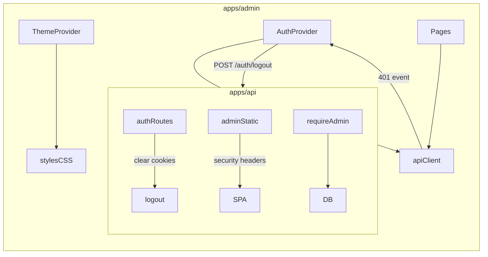

# Plan: Full admin audit remediation (+ dark theme)

## Goal

Fix every finding from the `apps/admin` audit (security, CSS/style, general quality) and add **light/dark theme** inspired by `apps/client/src/theme/palettes/default.ts`, with **system preference + manual toggle** (preference in `localStorage`).

No product scope creep beyond what the audit already listed. Prefer small, focused files over new frameworks.

## Constraints / decisions

| Topic | Decision |
|-------|----------|
| Theme | `data-theme="light\|dark"` on `<html>`; CSS variables from default palette; resolve: `localStorage` override → else `prefers-color-scheme` |
| Auth model | Keep Bearer in `localStorage` as admin’s primary credential, but **always clear httpOnly cookies** on logout / failed admin probe via new API endpoint |
| Entity types | Prefer **shared constant** derived from sync-recoverable names (not `User` / `OperationLog`) so Recovery dropdown never drifts; optional thin API list is unnecessary if constant matches handlers |
| Tier names | Client-side map via `TierApiService.list()` (no API DTO change) |
| i18n | UI stays English; set `index.html` `lang="en"` |
| Verification | Run `apps/admin` unit tests; for UI/theme, use browser if tools available, else vitest + manual checklist |

## Architecture (high level)

---

## PR / work phases

Work can land as one branch with logical commits, or stacked PRs. Implementation order below is dependency-aware.

### Phase 1 — API auth logout + security headers

**Files:** `apps/api/src/modules/auth/auth.route.ts`, auth tests, `apps/api/src/index.ts` (admin static + SPA fallback)

1. Add `POST /auth/logout` that clears `access_token` and `refresh_token` cookies (`maxAge: 0` / empty value, same `path: '/'`, `httpOnly`, `secure`, `sameSite: 'lax'` as login).
2. Idempotent / always 200 (even if already logged out).
3. On admin HTML / static responses under `/admin` (SPA fallback + ideally static plugin path), set:
   - `Content-Security-Policy`: `default-src 'self'; script-src 'self'; style-src 'self'; img-src 'self' data:; connect-src 'self'; frame-ancestors 'none'; base-uri 'self'; form-action 'self'`
   - `X-Content-Type-Options: nosniff`
   - `Referrer-Policy: no-referrer`
   - `X-Frame-Options: DENY` (or rely on CSP `frame-ancestors`)
4. Add/extend API auth tests for logout cookie clearing.

### Phase 2 — Admin auth hardening

**Files:** `apiClient.ts`, `AdminAuthService.ts`, `AuthContext.tsx`, `RequireAdmin.tsx`, `LoginPage.tsx`, related tests

1. **apiClient**
   - Bump `axios` range to match client (`^1.13.2` or current lock); set `allowAbsoluteUrls: false`.
   - Helper `assertSafePathId(id)` (ULID / reject `://`, `http`, `/`, `..`) used by user/recovery URL builders.
   - On 401: `clearToken()` + dispatch `keres-admin-session-cleared` (CustomEvent).
   - Optionally also clear on 403 for admin routes only — prefer 401 for session; keep 403 as “forbidden but still logged in” unless probe fails.
2. **AdminAuthService.login**
   - Set token only **after** admin probe succeeds (or set then clear — current — but always call logout endpoint on probe failure to clear cookies).
   - Distinguish 403 (“not admin”) vs network/5xx (generic error); still clear local token + cookies on any failed probe after login.
   - Wire `logout()` to `POST /auth/logout` (best-effort; ignore network errors) then `clearToken()`.
3. **AuthContext**
   - Persist `username` in `localStorage` (key next to token) on login; restore on boot.
   - On mount with token: re-probe cheap admin endpoint (`GET /admin/api/users?pageSize=1`); on failure → full logout + unauthenticated.
   - Listen for `keres-admin-session-cleared` → set React state logged out (and best-effort cookie logout once).
   - Memoize context value.
4. **RequireAdmin / LoginPage**
   - While bootstrapping probe, show loading (avoid flash of protected UI).
   - If already authenticated, `/login` redirects to `/users`.

### Phase 3 — Theme system + CSS overhaul

**New/updated files:** `src/theme/ThemeProvider.tsx` (or `auth`-adjacent `theme/`), rewrite `styles.css`, `Layout.tsx`, `main.tsx`, `index.html`

1. Map palette from `default.ts` into CSS variables:

   | Token | Light | Dark |
   |-------|-------|------|
   | `--color-primary` | `#6200EE` | `#BB86FC` |
   | `--color-primary-variant` | `#3700B3` | `#3700B3` |
   | `--color-bg` | `#FFFFFF` / page `#F5F5F5` | `#121212` |
   | `--color-surface` / `--color-card` | `#FFFFFF` / `#F5F5F5` | `#121212` / `#1E1E1E` |
   | `--color-text` / `--color-text-secondary` | `#000` / `#666` | `#FFF` / `#AAA` |
   | `--color-border` | `#E0E0E0` | `#333` |
   | `--color-error` / `--color-accent` | `#B00020` / `#00C853` | `#CF6679` / `#69F0AE` |
   | sidebar | dark purple surface (primaryVariant / card) | same family, tuned for dark |

2. Resolution logic (user choice):
   - `themePreference`: `'system' | 'light' | 'dark'` in `localStorage`
   - Effective theme = preference if light/dark, else `matchMedia('(prefers-color-scheme: dark)')`
   - Listen to media query when preference is `system`
   - Toggle in sidebar: cycle or segmented control System / Light / Dark (compact: one button that cycles is fine)

3. CSS fixes from audit:
   - Replace hardcoded colors with variables; shared `.surface` / card styles
   - Button variants: `.button` / `button.primary`, `.button-secondary`, `.button-danger`, `.sidebar button` ghost
   - Fix `.form-card label.checkbox-label` to row layout
   - `:focus-visible` rings
   - Responsive: collapse sidebar (top bar / drawer under ~800px), `flex-wrap` toolbars, stack `.log-layout`, `.table-scroll { overflow-x: auto }`
   - Login labels column + full-width inputs; `a.button` shares hover/focus with buttons
   - Selected row style for log/operation detail
   - `.mono-code` class (remove inline style)
   - Improve `.hint` contrast; deleted row badge instead of only opacity if easy
   - `lang="en"` on `index.html`

### Phase 4 — Page / UX / data bugs

**Pages + shared metadata**

1. **UsersListPage / LogsPage:** applied-filters state; search sets page=1 via state only; `useEffect` loads; `AbortController` / ignore flag on cleanup. Initial `loading: true` where mount-fetch. Empty-state row. Confirm copy stronger when deleting an admin.
2. **UsersListPage:** load tiers once; show tier **name**; keep id as fallback.
3. **UserFormPage:** surface tier load errors; confirm when enabling `isAdmin`; copy-to-clipboard for recovery codes; keep regenerate confirm.
4. **TiersPage:** checkbox for `isDefault`; loading/empty/saving; gap on Edit/Delete; danger style on Delete.
5. **RegistrationSettingsPage:** don’t swallow tier errors.
6. **RecoveryPage:** import recoverable entity list from `@keres/shared` (new export — see below); separate error/loading for operation log; keyboard-accessible rows (`tabIndex={0}` + Enter/Space or button-in-cell); selected class.
7. **LogsPage:** same a11y for clickable rows; wrap table scroll.
8. **Layout:** `aria-label` on nav; theme toggle; username display; secondary Sign out button.

**Shared package**

- Add e.g. `packages/shared/metadata/recoverableEntityTypes.ts` exporting sorted string array matching sync handlers (all `OperationLogEntityType` values except `User` and `OperationLog`), export from `packages/shared/index.ts`.
- Use in `RecoveryPage` instead of hardcoded `ENTITY_TYPES`.

### Phase 5 — Tests + polish

1. Update `AdminAuthService.test.ts` (logout call, probe error branching, token-after-probe).
2. Update `apiClientInterceptors.test.ts` (session event on 401; absolute URL rejection if tested).
3. Update `authContext.test.tsx` (username restore, session-cleared listener, bootstrap).
4. Adjust `pageActions.test.tsx` if selectors/classes change (button text still preferred).
5. Add small theme preference unit test (resolve system/light/dark).
6. API logout test.
7. Run `bun run test` / `typecheck` / `lint` in `apps/admin` (and auth tests in `apps/api`).

### Phase 6 — Browser verification (user rule)

If browser MCP tools are available: login flow, theme toggle (system/light/dark), users search pagination, tiers isDefault, recovery filter list, logout then confirm cookie-authenticated call fails, mobile viewport sidebar. Otherwise document what was verified via tests only.

---

## File touch list (expected)

| Area | Paths |
|------|--------|
| API | `auth.route.ts`, auth tests, `index.ts` (headers) |
| Admin core | `apiClient.ts`, `AdminAuthService.ts`, `AuthContext.tsx`, `RequireAdmin.tsx`, `LoginPage.tsx`, `main.tsx`, `index.html`, `package.json` |
| Theme/CSS | `src/theme/*` (new), `styles.css`, `Layout.tsx` |
| Pages | all under `src/pages/**` |
| Shared | `recoverableEntityTypes.ts` + `index.ts` |
| Tests | `apps/admin/test/**`, relevant `apps/api/test/modules/auth*` |

---

## Out of scope (explicit)

- Rewriting admin in Tailwind or sharing RN `ThemeProvider` runtime
- Server-side session revocation list / refresh-token denylist
- Full i18n catalogs for admin
- Changing JWT claims to embed `isAdmin`
- Paginating recovery deleted-list API (audit noted; leave unless trivial)

## Risk notes

- CSP must not break Vite-built hashed assets (`script-src 'self'` is enough for prod build).
- Dev Vite HMR may need looser CSP only in Vite itself (API headers apply to prod co-hosting).
- Calling `/auth/logout` from admin in Vite proxy already covers `/auth` — good.
- Cookie clear must use **identical** `path`/`secure`/`sameSite` as set, or browsers keep the cookie.
