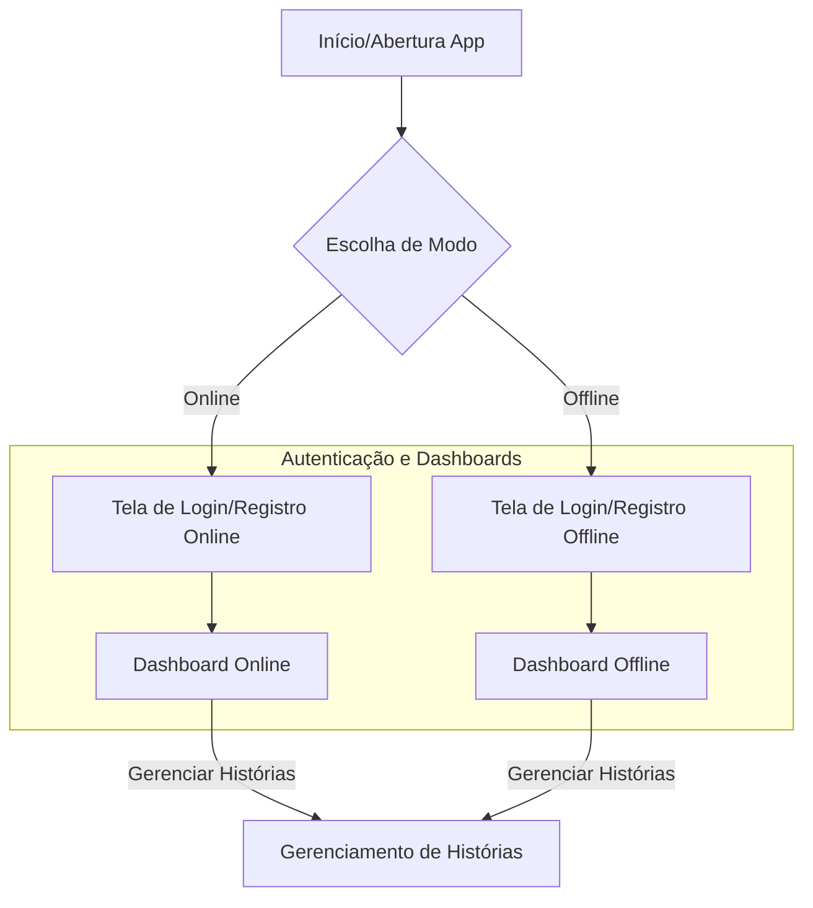
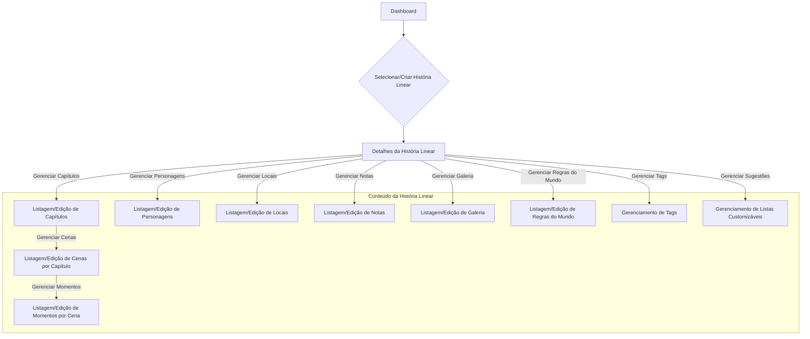
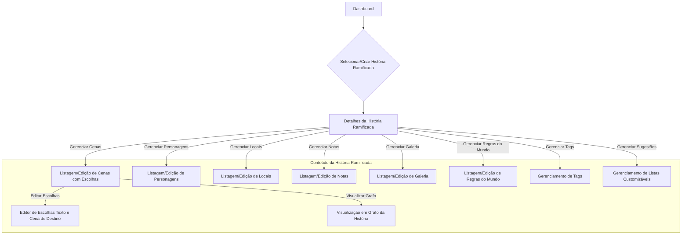
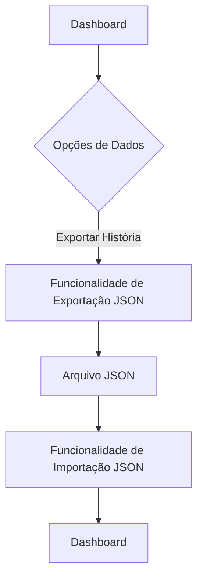

# Estratégia de Desenvolvimento do Frontend Keres

Este documento descreve a estratégia para o desenvolvimento do frontend do aplicativo Keres, com foco nas tecnologias, modos de operação (online/offline) e a adaptação da interface do usuário para diferentes estruturas de história.

## 1. Visão Geral e Tecnologias

O frontend do Keres será construído com uma abordagem multiplataforma, utilizando:

*   **React Native:** Como base para o desenvolvimento de aplicativos móveis nativos.
*   **Expo:** Para simplificar o ciclo de desenvolvimento, build e deploy, incluindo a versão web.
*   **React Native Web:** Para compilar a mesma base de código React Native para a web, garantindo uma experiência unificada.

A estrutura monorepo do projeto (`apps/client`) facilita o compartilhamento de código, como schemas Zod e tipos definidos em `packages/shared`, otimizando o desenvolvimento e a consistência.

## 2. Modos de Operação e Gerenciamento de Dados (UX Híbrida)

O Keres oferecerá uma experiência de usuário híbrida, permitindo que o usuário escolha entre operar em modo "Online" ou "Offline" no ponto de entrada do aplicativo.

### 2.1. Modo Online

Neste modo, o aplicativo se conectará a um backend remoto (a API Hono) para todas as operações de dados. Isso permitirá acesso a dados compartilhados e, futuramente, funcionalidades de colaboração.

### 2.2. Modo Offline

No modo offline, o aplicativo se conectará a um backend local, utilizando um banco de dados SQLite independente no próprio dispositivo do usuário.

*   **Desktop (via Electron):** O `apps/api` será empacotado junto com o frontend Electron, operando como um serviço local que se conecta ao SQLite.
*   **Mobile:** O aplicativo móvel interagirá diretamente com um banco de dados SQLite local (via bibliotecas React Native específicas para SQLite), sem a necessidade de empacotar o backend Hono completo.

### 2.3. Isolamento e Transferência de Dados

Uma característica fundamental desta estratégia é o **isolamento completo dos dados** entre os modos online e offline. Não haverá sincronização automática para evitar a complexidade de resolução de conflitos e garantir a previsibilidade.

A transferência de dados entre os modos será realizada manualmente através de funcionalidades de **exportação e importação JSON** de histórias completas, dando total controle ao usuário sobre seus dados.

## 3. Adaptação da UI para Estruturas de História Dinâmicas

A interface do usuário do Keres se adaptará dinamicamente com base no `type` da entidade `Story` (`'linear'` ou `'branching'`).

### 3.1. UI para Histórias Lineares

Para histórias com `Story.type = 'linear'`, a interface de usuário existente para criação e edição de capítulos e cenas será mantida. O campo `index` continuará a guiar a ordem de exibição e navegação sequencial. As escolhas implícitas, geradas automaticamente pelo backend, não serão expostas ou editáveis diretamente na UI.

### 3.2. UI para Histórias Ramificadas (Interactive Fiction/CYOA)

Quando `Story.type = 'branching'`, uma nova interface de usuário será ativada. Esta UI permitirá que os usuários definam explicitamente as escolhas para cada cena (texto da escolha e a cena de destino). Uma ferramenta de visualização em grafo poderá ser implementada para exibir cenas como nós e escolhas explícitas como arestas direcionadas, representando visualmente a narrativa ramificada.

## 4. Interação com a API

O frontend consumirá a API Hono (`apps/api`) para todas as operações de dados. As principais categorias de funcionalidades da API com as quais o frontend interagirá incluem:

*   Autenticação e Gerenciamento de Usuários
*   Gerenciamento de Histórias (CRUD completo)
*   Gerenciamento de Capítulos, Cenas e Momentos
*   Gerenciamento de Personagens, Locais e Regras do Mundo
*   Gerenciamento de Escolhas (para histórias ramificadas)
*   Gerenciamento de Galeria, Notas e Tags
*   Gerenciamento de Sugestões (listas customizáveis)
*   Funcionalidades de Pesquisa Global

## 5. Fluxo de Telas e Desenvolvimento

Para melhor compreensão do fluxo de telas e da interação entre os diferentes modos e tipos de história, apresentamos múltiplos diagramas Mermaid, cada um focando em um aspecto específico.

### 5.1. Fluxo Geral do Aplicativo

Este diagrama ilustra o fluxo inicial do usuário, desde a abertura do aplicativo até o acesso aos dashboards, incluindo a seleção do modo de operação.

### 5.2. Gerenciamento de Conteúdo - História Linear

Este diagrama detalha o fluxo para gerenciar o conteúdo de uma história do tipo 'linear'.

### 5.3. Gerenciamento de Conteúdo - História Ramificada (CYOA)

Este diagrama foca no fluxo para gerenciar o conteúdo de uma história do tipo 'branching', incluindo a mecânica de escolhas.

### 5.4. Fluxo de Exportação e Importação de Dados

Este diagrama ilustra o processo de transferência manual de dados entre os modos online e offline.

### Telas e Componentes Principais

Com base nas entidades e funcionalidades da API, o frontend deverá contemplar as seguintes telas e componentes principais:

*   **Telas de Autenticação:**
    *   Tela de Boas-Vindas / Seleção de Modo (Online/Offline)
    *   Tela de Login
    *   Tela de Registro
    *   Tela de Perfil do Usuário
*   **Telas de Gerenciamento de Histórias:**
    *   Dashboard Principal (listagem de todas as histórias, com filtros e busca)
    *   Tela de Criação/Edição de História (com seleção de tipo: Linear/Ramificada)
    *   Tela de Detalhes da História (visão geral, acesso a sub-entidades)
*   **Telas de Gerenciamento de Conteúdo (por História):**
    *   **Capítulos:**
        *   Listagem de Capítulos
        *   Criação/Edição de Capítulo
        *   Detalhes do Capítulo
    *   **Cenas:**
        *   Listagem de Cenas (por Capítulo ou Global)
        *   Criação/Edição de Cena
        *   Detalhes da Cena
    *   **Momentos:**
        *   Listagem de Momentos (por Cena)
        *   Criação/Edição de Momento
        *   Detalhes do Momento
    *   **Personagens:**
        *   Listagem de Personagens
        *   Criação/Edição de Personagem
        *   Detalhes do Personagem
        *   Gerenciamento de Relações de Personagens
        *   Gerenciamento de Momentos de Personagens
    *   **Locais:**
        *   Listagem de Locais
        *   Criação/Edição de Local
        *   Detalhes do Local
    *   **Notas:**
        *   Listagem de Notas
        *   Criação/Edição de Nota
        *   Detalhes da Nota
    *   **Galeria:**
        *   Listagem de Itens da Galeria
        *   Upload/Edição de Item da Galeria
        *   Visualização de Imagem
    *   **Tags:**
        *   Gerenciamento de Tags (criação, edição, associação a entidades)
    *   **Regras do Mundo:**
        *   Listagem de Regras do Mundo
        *   Criação/Edição de Regra do Mundo
        *   Detalhes da Regra do Mundo
    *   **Sugestões (Listas Customizáveis):**
        *   Gerenciamento de Listas de Sugestões (Gêneros, Raças, Tipos de Relação, etc.)
*   **Telas Específicas para Histórias Ramificadas:**
    *   Editor de Escolhas (para cada cena, definir texto e cena de destino)
    *   Visualizador de Grafo da História (representação visual das cenas e escolhas)
*   **Telas de Utilidade:**
    *   Tela de Pesquisa Global (com resultados filtrados por entidade)
    *   Telas de Exportação/Importação de Dados (JSON)
    *   Configurações do Aplicativo

## 6. Entidades Gerenciadas pelo Frontend

O frontend do Keres interagirá e gerenciará as seguintes entidades principais, refletindo a estrutura do backend:

*   **Usuários (`User`)**: Gerenciamento de perfis e autenticação.
*   **Histórias (`Story`)**: A entidade central, com tipo (`linear` ou `branching`), título, resumo, etc.
*   **Capítulos (`Chapter`)**: Agrupadores de cenas dentro de uma história.
*   **Cenas (`Scene`)**: Unidades narrativas que contêm momentos e podem ter escolhas.
*   **Momentos (`Moment`)**: Os "átomos" da história, eventos ou diálogos específicos dentro de uma cena.
*   **Personagens (`Character`)**: Detalhes sobre os personagens da história.
*   **Locais (`Location`)**: Informações sobre os cenários da história.
*   **Escolhas (`Choice`)**: Conexões entre cenas em histórias ramificadas.
*   **Galeria (`Gallery`)**: Imagens associadas a entidades da história.
*   **Notas (`Note`)**: Textos livres para anotações do autor.
*   **Tags (`Tag`)**: Para categorização e organização de entidades.
*   **Regras do Mundo (`WorldRule`)**: Definições e regras do universo da história.
*   **Sugestões (`Suggestion`)**: Listas customizáveis (gêneros, raças, etc.).
*   **Associações (`CharacterMoment`, `CharacterRelation`)**: Tabelas relacionais para conectar personagens a momentos e a outros personagens.

Para o desenvolvimento, os seguintes comandos podem ser utilizados na raiz do projeto:

*   `bun run dev`: Inicia os servidores de desenvolvimento para a API e o cliente (web).
*   `bun --cwd apps/client start`: Inicia o servidor de desenvolvimento do Expo para o cliente (web, Android, iOS).
*   `bun --cwd apps/client android`: Inicia o aplicativo Android no emulador/dispositivo.
*   `bun --cwd apps/client ios`: Inicia o aplicativo iOS no simulador/dispositivo.
*   `bun --cwd apps/client web`: Inicia o aplicativo web no navegador.
